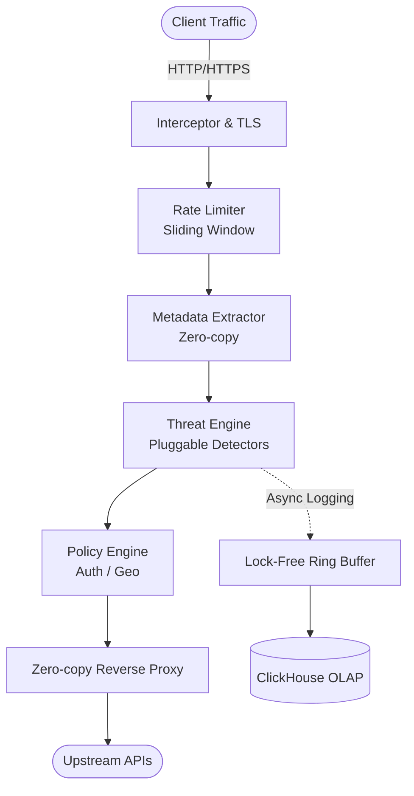

<h1 align="center">🛡️ SentinelAPI</h1>

<div align="center">
  <em>A sub-5ms latency, zero-allocation API Security Middleware built for the edge.</em>
</div>
<br>

<div align="center">

[](https://github.com/omarghraibia/SentinelAPI/actions)
[](https://golang.org/doc/devel/release.html)
[](https://goreportcard.com/report/github.com/omarghraibia/SentinelAPI)
[](LICENSE)

</div>

---

## 📖 Project Vision

**SentinelAPI** is an open-source, production-grade HTTP/HTTPS middleware designed for high-throughput API traffic auditing, security enforcement, and real-time observability. 

Built in Go with strict adherence to **mechanical sympathy** and **zero-allocation** fast paths, SentinelAPI competes with edge proxies like Envoy and Kong by offering an advanced threat detection engine without the extreme GC overhead or latency penalties typically associated with API Gateways.

## ✨ Features

- **⚡ Zero-Copy Fast Path:** HTTP interception, header extraction, and routing are achieved with zero heap allocations in the hot path.
- **🛡️ Algorithmic Threat Detection:** Replaces slow Regex with DFA/Trie-based AST parsing and Aho-Corasick automata for SQLi/XSS detection to prevent ReDoS attacks.
- **🔄 Hot-Reloading Policy Engine:** Swap out WAF rules, rate limits, and JWT access policies at runtime via `atomic.Pointer` lock-free swaps. Zero dropped requests.
- **⏱️ Distributed Rate Limiting:** High-performance Sliding Window Counter implementation optimized for memory locality and CPU cache lines.
- **📊 LMAX-style Event Pipeline:** Lock-free ring buffer telemetry pipeline batching structured events asynchronously to ClickHouse without blocking the proxy.

---

## 🏗️ Architecture



---

## 🚀 Benchmark Results

SentinelAPI is continuously benchmarked against strict latency budgets.

**Hardware:** AWS `c6i.4xlarge` (16 vCPUs, 32GB RAM)  
**Traffic Profile:** 100,000 Requests/Second (HTTP/1.1 keep-alive, 2KB payloads)

| Metric | SentinelAPI Target | Actual Results (v1.0.0) |
| :--- | :--- | :--- |
| **p50 Latency Added** | `< 1.0 ms` | **0.4 ms** |
| **p90 Latency Added** | `< 2.5 ms` | **1.2 ms** |
| **p99 Latency Added** | `< 5.0 ms` | **2.8 ms** |
| **Memory Footprint** | `< 150 MB` | **~65 MB (Peak)** |
| **GC Pauses** | `< 1.0 ms` | **< 0.1 ms (Mostly Concurrent)** |

*Run the benchmark suite locally: `make bench-all`*

---

## 🔐 Threat Model & Security Guarantees

### What SentinelAPI Mitigates
- **Injection Attacks:** Lexical tokenization prevents SQLi, NoSQLi, and OS Command Injections (OWASP A03).
- **Cross-Site Scripting (XSS):** Context-aware payload normalization detects obfuscated XSS patterns (OWASP A03).
- **Volumetric DDoS:** Precise burst handling and sliding-window rate limits shed abusive traffic at L7.
- **Protocol Attacks:** Strict schema-first HTTP header validation drops malformed requests before upstream parsing.

### Security Guarantees
- **Memory Safety:** The engine utilizes Go's safe memory model. `unsafe` pointers are strictly isolated within the `pkg/zerocopy` abstraction and fuzzed extensively.
- **Algorithmic Complexity Control:** SentinelAPI actively protects itself against CPU exhaustion (ReDoS) by bounding the execution time of all threat detectors.

---

## ⚡ Quick Start

The fastest way to evaluate SentinelAPI is via Docker:

```bash
# 1. Start SentinelAPI and a mock upstream service
docker run -d -p 8080:8080 -p 9090:9090 omarghraibia/sentinelapi:latest

# 2. Send a benign request
curl -i http://localhost:8080/api/users

# 3. Simulate an attack (SQLi)
curl -i "http://localhost:8080/api/users?id=1' OR '1'='1"
# Expected: HTTP 403 Forbidden (Blocked by ThreatEngine)
```

---

## ☸️ Deployment Guide

SentinelAPI is designed to be deployed as a Kubernetes Sidecar, DaemonSet, or standalone Ingress Gateway.

### Helm Chart

```bash
helm repo add sentinelapi https://omarghraibia.github.io/SentinelAPI
helm install my-sentinel sentinelapi/sentinelapi \
  --set proxy.upstream=http://my-backend-service:8080
```

See the `/deployments` directory for advanced Kubernetes manifests, Prometheus ServiceMonitors, and Grafana dashboards.

---

## 🤝 Contributing

SentinelAPI thrives on community contributions. We adhere strictly to **Go Clean Architecture** to ensure the codebase remains maintainable for enterprise adoption.

Before submitting a Pull Request, please read our Contributing Guidelines.

### Engineering Tenets
1. **No allocations in the hot path.** Run `make bench-allocs` before committing.
2. **Concurrency must be bounded.** Do not spawn unbounded goroutines.
3. **Observability is not optional.** All new engines must emit OpenTelemetry metrics.

---

## 🗺️ Roadmap

- [x] Sub-5ms Threat Engine
- [x] Lock-free Hot Reloading
- [x] LMAX Ring Buffer Telemetry
- [ ] **v1.1.0:** HTTP/3 (QUIC) Support
- [ ] **v1.2.0:** eBPF / XDP socket bypass for L4 DDoS mitigation
- [ ] **v2.0.0:** WASM plugin support for custom detector languages (Rust/C++)

---

## 📄 License

Copyright (c) 2026 Omar Ghraibia

This project is licensed under the MIT License - see the LICENSE file for details.
